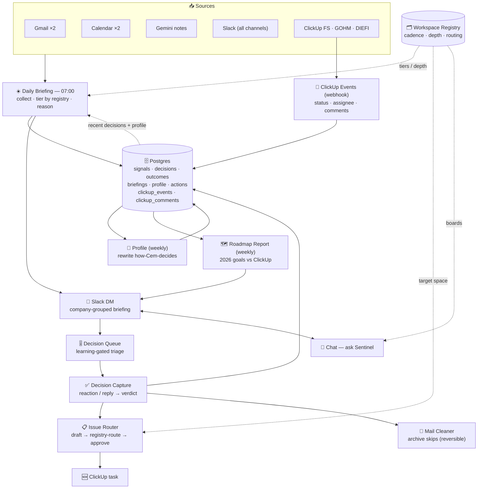

# Sentinel

A personal **chief-of-staff AI** for Cem Ayyildiz — CTO of FreshSens, GM of GOHM, and lead on the DIEFI EU research project.

Every morning at **07:00 Istanbul**, Sentinel gathers Cem's entire working world (email, calendar, meeting transcripts, team Slack, and task boards across three organizations), reasons over it like an analyst, and delivers a prioritized briefing to his Slack DM: a tight **cockpit** (🎯 YOUR DAY — the 3–5 things Cem personally should do, with clickable links and time estimates) as the main message, with per-company detail in the thread. Continuity is **stateful**: an open-issue ledger stored in Postgres carries every unresolved item forward with real day-counts.

It is built as an **n8n workflow** driven by Claude, with all integrations done through direct API calls.

---

## What it does

- **Reads everything** — both Gmail inboxes (+ a safety net over recently-archived mail), both calendars, Gemini meeting notes from Drive, every Slack channel it's in (public + private), Cem's own DM/thread messages (his stated focus), and ClickUp across FreshSens / GOHM / DIEFI.
- **Prioritizes for Cem, not just the org** — 🎯 YOUR DAY ranks his personal top 3–5 actions by an explicit rubric (production impact → external deadline → unblocks a person → 2026 goal), each with a clickable link and a ⏱ estimate; 🔥 Top Priorities are ranked against the **2026 Miro roadmap goals** and tagged with the goal they advance.
- **Tracks continuity statefully** — an **open-issue ledger** (JSON, stored per briefing) carries every unresolved item with its `first_seen` date; day-counts are computed from state, never guessed by the model.
- **Triages the overdue debt** — surfaces the top 3 of Cem's overdue tasks daily with a verdict each (do / reschedule / delegate) and a Friday sweep over the rest.
- **Reasons, doesn't summarize** — correlates signals across sources (e.g. an API outage → cascading backend 500s) and correlates Slack alarms into incidents.
- **Organizes by your real structure** — FreshSens by functional team, GOHM by funded project, plus a personal/smart-home view.
- **Triages the inbox, trust-safely** — reply / delegate dispositions only; Cem curates his own inbox and Sentinel **never archives or deletes** anything.

---

## Architecture

Sentinel is a set of **n8n workflows** backed by **Postgres** and a **Claude CLI** node. The whole
system is a loop: **signal → decide → act → learn → (smarter next signal)**. A **workspace registry**
(`infra/workspaces.json` → Postgres) tells every workflow how each ClickUp space / Slack channel / Gmail
rule should be reported and routed.



- **Daily Briefing** (07:00 IST) gathers everything, tiers ClickUp/Slack by the registry, reasons like an
  analyst, and DMs a company-grouped briefing — pre-classifying new items by how Cem has decided before.
- **Decision Queue → Capture → Profile** is the learning loop: surfaced items get a verdict (reaction/reply);
  verdicts become a compact profile that sharpens tomorrow's triage.
- **Issue Router** turns decisions into registry-routed ClickUp tasks (Cem approves with ✅).
- **ClickUp Events** ledger captures live status/assignee/comment changes (exact weekly story points + the
  daily "new comments" view). **Chat** answers "who's doing what?". **Roadmap Report** tracks 2026 goals.

> **Design choice:** Code nodes + `this.helpers.httpRequest` with refresh tokens / API keys throughout
> (native n8n credential nodes proved unreliable); each source is isolated so one failure never kills the run.

The full per-workflow catalog (triggers, flows, IDs, files) lives in
[`workflows/README.md`](workflows/README.md); architecture rationale in
[`SENTINEL_DESIGN.md`](SENTINEL_DESIGN.md).

---

## Data sources

| Source | Detail |
|---|---|
| **Gmail** | FreshSens (`ca@freshsens.ai`) + GOHM (`cem.ayyildiz@gohm.tech`) — ~25 inbox emails/account with triage signals (category, bulk, automated). |
| **Calendar** | Both accounts' primary calendars, yesterday → today. |
| **Meeting notes** | Gemini "Notes by Gemini" Google Docs in Drive (both accounts), since yesterday — summary extract for real meeting context. |
| **Slack** | Auto-discovers **every channel the bot belongs to** (currently 25: 6 public + 19 private). Invite `@sentinel` to a channel and it appears in the next briefing automatically. |
| **ClickUp** | FreshSens (`9009068877`), GOHM (`42085420`), DIEFI (`9014647941`) — **registry-tiered**: Development as a full sprint board (Review=done, story points, hygiene), Management/GOHM/DIEFI daily, Sales/Team-Leads/Fundraising weekly, plus live task comments + Cem's overdue + villakurt (smart-home). |

---

## How the briefing is organized

The prose briefing is **grouped by company**: a short cross-org cockpit, then one
self-contained block per company. **Delivery:** the cockpit is the main Slack message
(hard-capped, the only part Cem must read); the company blocks arrive as threaded replies.

**Cockpit (cross-org, ≤400 words):**
1. **🎯 YOUR DAY** — Cem's personal top 3–5 actions, rubric-ranked, linked, time-estimated (≤60 min total); honors any focus he stated in DM/thread replies
2. **🔁 Since Yesterday** — from the stored open-issue ledger: still-open (real day-counts) / resolved / new
3. **📌 Today's Schedule** — one timeline, each meeting tagged 🔴/🟡/⚪ and [FS]/[GOHM]/[DIEFI]
4. **🔥 Top Priorities** — ranked across all orgs with 2026-goal tags, escalations pulled in
5. **⏳ Overdue (yours)** — top 3 with do/reschedule/delegate verdicts; Friday sweep over the rest
6. **🗣️ From Yesterday's Meetings** — decisions/actions from the Gemini notes (says so explicitly when notes are missing)

**Per-company blocks:**
- **🏭 FreshSens** — Development by team (ML/HW/FW/Backend/Software/PH) + new task comments +
  **board-hygiene** nudge; Management; FreshSens incidents; FreshSens inbox triage; (Fridays)
  **📊 Weekly Review** — completed issues + story points per person + Multica agent deliveries
- **🛰️ GOHM** — projects (Management hub · Robust6G · Q-TRUST6G); GOHM incidents; GOHM inbox
- **🔬 DIEFI** — progress, deliverable deadlines, Cem's actions
- **🏠 Personal / Smart Home** — villakurt (Loxone + house) items (all open tasks, not just recently-touched)
- **✅ Quick Wins** — 1–3 closable in <15 min, each linked

### Registry-driven cadence & tiering
A **workspace registry** (`infra/workspaces.json` → Postgres `workspaces`) is the single source of
truth for how each ClickUp space, Slack channel, and Gmail rule is reported:
- **Cadence** — `daily` (Development, Management, GOHM, DIEFI), `weekly-fri` (Sales/Marketing/PH&Ops,
  Team Leads, Fundraising — folded into Friday), or `mute`. Items in weekly/muted spaces still
  escalate into the daily when critical (urgent/high · overdue · blocker · Cem-assigned).
- **Depth** — `deep` (full sprint board + comments + hygiene), `track`, or `summary`.
- **Routing** — keywords route Sentinel-created issues to the right space (default Management).

Edit the JSON, run `infra/sync-workspaces.py`, and the briefing, issue router, and chat all pick it up.

---

## Capabilities summary

| Capability | Status |
|---|---|
| Daily multi-source briefing (cockpit + threaded company detail) | ✅ live (07:00 Istanbul) |
| 🎯 YOUR DAY — rubric-ranked personal actions with links + estimates | ✅ live |
| Stateful open-issue ledger (real day-counts, carried in Postgres) | ✅ live |
| Overdue-debt triage (top 3 daily + Friday sweep) | ✅ live |
| Priorities ranked against 2026 Miro roadmap goals | ✅ live |
| Cem's stated focus read from DM + briefing-thread replies | ✅ live |
| Issue correlation into incidents | ✅ live |
| Registry-driven cadence/tiering (daily/weekly/escalation) | ✅ live |
| ClickUp board hygiene flags (stale / missing points / no review) | ✅ live |
| Live task-comment capture + daily progress view | ✅ live |
| Weekly story points per person + agent deliveries (Fridays) | ✅ live |
| Inbox triage (reply / delegate; never archives — Cem curates) | ✅ live |
| Learning loop (decisions → profile → pre-classification) | ✅ live |
| Slack-approved issue creation, registry-routed | ✅ live |
| Chat assistant (ask Sentinel) | ✅ live |
| Meeting-notes gap alarm (meetings happened but no Gemini notes) | ✅ live |
| Draft replies | ⬜ planned |
| Auto-create tasks from meeting actions | ⬜ planned |
| Decision log from meeting transcripts (principle #4) | ⬜ planned |

See [`todo.md`](todo.md) for the full roadmap.

---

## Security model

- **No secret is committed.** `credentials/`, `.mcp.json`, and local settings are gitignored. The workflow source in this repo has every secret redacted (`__GOOGLE_REFRESH_TOKEN__`, `__SLACK_BOT_TOKEN__`, etc.); real values live only in the n8n credential store and the local `credentials/` directory.
- **Archiving never deletes.** It removes the `INBOX` label and applies `Sentinel/FYI-Archived` — everything stays in All Mail and is one click from being restored.
- **Security guardrail.** Login / password / verification / payment-failure notices are never archived; they stay in the inbox.
- **Slack is read-only** in the channels — Sentinel only posts to Cem's DM.

---

## Repository layout

```
sentinel/
├── README.md                  ← this file (overview + architecture)
├── CLAUDE.md                  ← working agreement for AI sessions (deploy/test patterns)
├── SENTINEL_DESIGN.md         ← architecture & rationale (diagrams)
├── SENTINEL_STATUS.md         ← live status, IDs, gotchas, handoff (§9 = registry/cadence)
├── todo.md                    ← roadmap & status
├── scripts/                   ← one-time OAuth setup helpers (gmail/calendar)
├── infra/
│   ├── schema.sql             ← Postgres schema
│   ├── workspaces.json        ← workspace registry (cadence/depth/routing — source of truth)
│   ├── sync-workspaces.py     ← sync the registry into the `workspaces` table
│   ├── refresh-roadmap.py     ← refresh the 2026 roadmap from Miro
│   └── SERVER_SETUP.md        ← server / Postgres / Slack-app setup
├── workflows/
│   ├── README.md              ← workflow catalog (all workflows, triggers, flows, IDs)
│   └── sentinel-*/            ← per-workflow secret-redacted source + deploy.py
└── credentials/               ← gitignored (OAuth tokens, keys)
```

Runs on n8n at `flow.gohm.tech`. Each workflow's `deploy.py`/`build.py` rebuilds/activates it via the
n8n public API (fill in the redacted secrets first). See [`workflows/README.md`](workflows/README.md).
