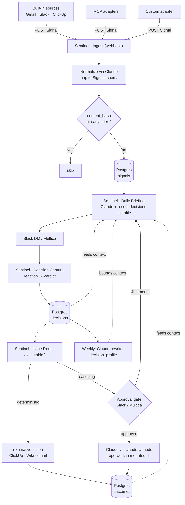
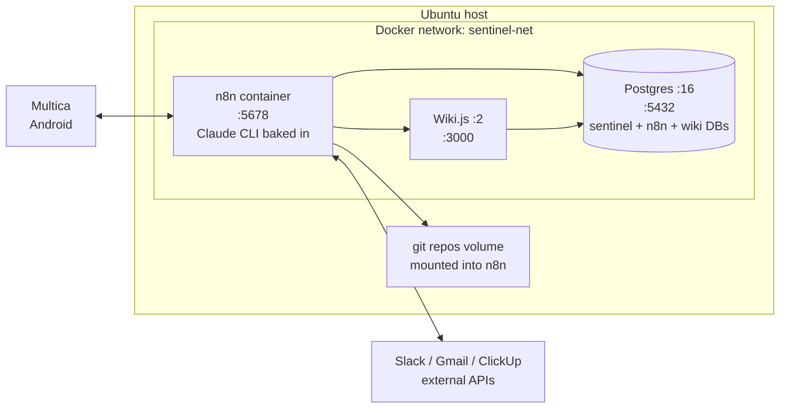

# Sentinel — System Design
> Purpose: single source of truth for the Sentinel personal AI system.
> Stack: n8n (flow.gohm.tech) + `@chrishdx/n8n-nodes-claude-cli` + Postgres + Wiki.js.
> Build and extend in VS Code with Claude Code.

## Vision (three pillars)

1. **Extensible inputs** — add a source or MCP server without rewriting the engine. Every input emits a normalized `Signal`.
2. **Daily decision collection** — every surfaced item gets a verdict from Cem, stored as a `Decision`.
3. **The system learns** — Claude reads recent decisions in each briefing and pre-classifies new signals by likeness to how Cem has decided before. It improves with every verdict, no retraining.

The whole system is a loop: **signal → decide → act → learn → (smarter next signal)**.

---

## Learning mechanism

Learning is done by Claude reasoning over recent decisions — not by vector similarity search. At single-user volume (a few dozen decisions a day), Claude holds the recent decision history in context and judges likeness directly: "this matches the Dependabot PRs you always skip → suggest skip." That keeps the system to plain Postgres, with no embedding model or vector store to run.

```
New signal ingested → stored in Postgres

Daily briefing (Claude) is given, in its prompt:
  ├── decision_profile  (compact: "always skip X, always do Y, delegate Z to person/agent")
  ├── recent decisions  (bounded window, raw: signal title + verdict + reason)
  └── today's new signals
  → Claude pre-classifies each new signal: suggested verdict + confidence + one-line why
  → surfaces high-confidence skips quietly (or auto-filters), asks on the rest

Cem reacts → new Decision row → feeds tomorrow's "recent decisions"

Periodically (weekly, or every N decisions):
  → Claude rewrites decision_profile from the full decision log
  → keeps briefing context bounded as history grows
```

The `decision_profile` is the compression layer that keeps context flat over time; the live pre-classification in each briefing is the actual learning. Every verdict changes what tomorrow shows and how it pre-sorts.

---

## Data model (Postgres)

```sql
-- Every input normalizes into this. Source-agnostic.
CREATE TABLE signals (
  id            UUID PRIMARY KEY DEFAULT gen_random_uuid(),
  source        TEXT NOT NULL,            -- 'gmail' | 'slack' | 'clickup' | 'mcp:<name>'
  source_ref    TEXT,
  org           TEXT,                     -- 'freshsens' | 'gohm' | 'diefi' | ...
  type          TEXT NOT NULL,            -- 'email' | 'message' | 'task' | 'event' | 'alert'
  title         TEXT,
  body          TEXT,
  actor         TEXT,
  url           TEXT,
  metadata      JSONB DEFAULT '{}',
  content_hash  TEXT UNIQUE,              -- dedup: skip if already seen
  ingested_at   TIMESTAMPTZ DEFAULT now()
);
CREATE INDEX ON signals (org, type, ingested_at);

-- One verdict per surfaced item. The learning source.
CREATE TABLE decisions (
  id            UUID PRIMARY KEY DEFAULT gen_random_uuid(),
  signal_id     UUID REFERENCES signals(id),
  verdict       TEXT NOT NULL,            -- 'do_now'|'do_later'|'delegate_person'|'delegate_agent'|'watch'|'skip'
  delegate_to   TEXT,
  reason        TEXT,
  decided_via   TEXT,                     -- 'slack_reaction'|'multica_voice'|'dashboard'
  decided_at    TIMESTAMPTZ DEFAULT now()
);
CREATE INDEX ON decisions (decided_at DESC);

-- Did the priority call / action turn out right? Closes the loop.
CREATE TABLE outcomes (
  id            UUID PRIMARY KEY DEFAULT gen_random_uuid(),
  decision_id   UUID REFERENCES decisions(id),
  result        TEXT,                     -- 'completed'|'cancelled'|'reclassified'|'ignored_3d'
  agent         TEXT,
  detail        TEXT,
  url           TEXT,
  recorded_at   TIMESTAMPTZ DEFAULT now()
);

-- Continuity (replaces parsing yesterday's Slack DM).
CREATE TABLE briefings (
  id            UUID PRIMARY KEY DEFAULT gen_random_uuid(),
  briefing_date DATE,
  prose         TEXT,
  open_issues   JSONB,
  created_at    TIMESTAMPTZ DEFAULT now()
);

-- The compact learned summary, rewritten periodically by Claude.
CREATE TABLE decision_profile (
  id            UUID PRIMARY KEY DEFAULT gen_random_uuid(),
  profile       JSONB,                    -- { always_skip:[...], always_do:[...], delegate_map:{...} }
  updated_at    TIMESTAMPTZ DEFAULT now()
);
```

The briefing pulls its learning context with plain SQL:

```sql
SELECT s.title, s.source, s.type, d.verdict, d.reason
FROM decisions d JOIN signals s ON s.id = d.signal_id
WHERE d.decided_at > now() - interval '60 days'
ORDER BY d.decided_at DESC
LIMIT 200;
```

---

## Adapter contract (how to add an input)

Every input — built-in source, MCP server, or future integration — is an **adapter** that produces a Signal. The engine never knows what the source is.

### Adapter output (the only contract)
```json
{
  "source": "mcp:notion",
  "source_ref": "page_abc123",
  "org": "gohm",
  "type": "task",
  "title": "Draft D1.4 deliverable outline",
  "body": "...",
  "actor": "cem",
  "url": "https://notion.so/page_abc123",
  "metadata": { "any": "source-specific fields" }
}
```
`content_hash` is added by Ingest. For a known source, the adapter can map fields deterministically; for an arbitrary or new source, post the raw payload and let **Claude normalize it** into this shape in the Ingest workflow.

### To add a new source
1. Build an n8n sub-workflow (or MCP call) that fetches from the source.
2. POST its output to the shared ingest webhook (`/sentinel/ingest`).
3. Done. Briefing, decision capture, and learning pick it up automatically — no engine changes.

---

## Execution tiers (the agentic workflow)

Two tiers, both running inside n8n:

| Tier | What it does | Approval? |
|------|-------------|-----------|
| **Deterministic action** | Create ClickUp task, post Wiki page, send email — via an MCP/API node. No reasoning. | Auto (low risk) |
| **Reasoning agent** | Claude via the `claude-cli` node. Drafts text, classifies, routes; or does repo work (write code, draft PR, refactor) in a git repo mounted into the n8n container. | **Required** for code/repo changes |

### Phase 2 agentic flow
```
Item flagged executable (queue)
  → Action router (Claude via claude-cli node): deterministic or reasoning?
     ├── deterministic → n8n native MCP/API call → result
     └── reasoning → Approval gate (Slack/Multica)
                       → on approve → claude-cli node runs Claude
                                       (in the mounted repo working dir for code work)
                       → result
  → outcome row written → posted to Slack thread → feeds learning
  → no approval in 4h → auto-defer to next briefing
```

---

## System flowchart



---

## Docker / software view



| Container / service | Image / source | Port | Volume | Purpose |
|---------------------|----------------|------|--------|---------|
| n8n | custom image (`n8nio/n8n` + Claude CLI baked in) | 5678 | `n8n_data`, plus git repos mounted for repo work | Orchestrator; runs all Sentinel workflows; all Claude reasoning via the `claude-cli` node |
| Postgres | `postgres:16` | 5432 (internal) | `pg_data` | Sentinel store (signals/decisions/outcomes/briefings/profile) + n8n's own DB + Wiki.js DB |
| Wiki.js | `requarks/wiki:2` | 3000 (proxied → wiki.freshsens.ai) | uses Postgres | Human-readable memory; learning memos |
| Multica | Android app | — | — | Voice/text interface (external) |

Notes:
- **Claude CLI in n8n:** the custom n8n image has the `claude` binary baked in and the Claude credentials available (the `claude-cli` node references a `claudeCliApi` credential). This is in place.
- **Repo work:** git repos are mounted into the n8n container so the `claude-cli` node can operate on them directly for Phase 2 reasoning work.
- **One Postgres for everything:** n8n's data, Sentinel's tables, and Wiki.js's DB all live in the same Postgres instance (separate databases) — three containers total.
- **Reverse proxy** (already fronting flow.gohm.tech and wiki.freshsens.ai) terminates TLS and routes to n8n :5678 and Wiki.js :3000.

---

## Two-phase implementation

### Phase 1 — Sense, decide, learn (no agents, zero risk)
- [ ] **Postgres** — provision (or reuse n8n's Postgres); run the schema DDL
- [ ] **Ingest workflow** (`Sentinel · Ingest`) — webhook → Claude normalize → `content_hash` → dedup → insert Signal
- [ ] **Built-in adapters** — refactor existing `Collect All Sources` into per-source sub-workflows that POST Signals (Gmail × 2, Slack, ClickUp × 3, Calendar, Meet notes)
- [ ] **Daily Briefing** (`Sentinel · Daily Briefing`) — read Signals from Postgres; inject `decision_profile` + recent decisions; Claude pre-classifies; store briefing row
- [ ] **Decision capture** (`Sentinel · Decision Capture`) — Slack `reaction_added` → verdict → Decision row → optional delegate follow-up
- [ ] **Profile builder** (`Sentinel · Profile`) — weekly: Claude rewrites `decision_profile` from the decision log
- [ ] **Credential migration** — move inline secrets to n8n credential store; rotate

Exit criteria: 2–3 weeks of decisions; pre-classification visibly improving.

### Phase 2 — Act and close the loop (agents)
- [ ] **Issue router** (`Sentinel · Issue Router`) — poll `verdict IN ('do_now','delegate_agent')`; classify deterministic vs reasoning
- [ ] **Deterministic executors** — n8n branches: ClickUp create, Wiki write, email send (MCP/API)
- [ ] **Approval gate** — Slack/Multica confirm + reaction listener; 4h auto-defer
- [ ] **Reasoning executor** — `claude-cli` node for light work and repo work (repos mounted into the container)
- [ ] **Result reporter** — thread reply + `outcomes` row
- [ ] **Outcome feedback** — include outcomes in the briefing context so wrong calls get corrected
- [ ] **Multica hooks** — "what are agents working on?", "what's pending?", "delegate this"

---

## n8n workflow inventory

| Workflow | Phase | Trigger | Purpose |
|----------|-------|---------|---------|
| `Sentinel · Ingest` | 1 | Webhook `/sentinel/ingest` | Claude normalize, hash dedup, store Signal |
| `Sentinel · Adapter: <source>` | 1 | Schedule / webhook | Fetch a source, emit Signals |
| `Sentinel · Daily Briefing` | 1 | Cron 04:00 UTC | Read Signals + profile + recent decisions → briefing |
| `Sentinel · Decision Capture` | 1 | Slack Events (`reaction_added`) | Write Decisions |
| `Sentinel · Profile` | 1 | Cron Sun 20:00 | Claude rewrites `decision_profile` |
| `Sentinel · Issue Router` | 2 | Poll (30 min) | Dispatch executable items to a tier |
| `Sentinel · Agent Executor` | 2 | Called by router | Deterministic action or Claude reasoning |
| `Sentinel · Result Reporter` | 2 | Called by executor | Post result, write outcome |

---

## Infrastructure map

| Component | Location | Role |
|-----------|----------|------|
| n8n (+ Claude CLI) | flow.gohm.tech (Docker) | Orchestrator; all Claude reasoning via the `claude-cli` node |
| Postgres | Ubuntu host (Docker) | Sentinel store + n8n + Wiki.js DBs |
| Wiki.js | wiki.freshsens.ai (Docker) | Human-readable memory, learning memos |
| Multica | Android | Voice/text interface |
| VS Code + Claude Code | Ubuntu host via Remote Tunnel | Build + agentic execution |

---

## Credential hygiene (do first, in Phase 1)

Inline in the current briefing JS nodes — move to n8n credential store, then rotate:

| Credential | Type | Action |
|------------|------|--------|
| `xoxb-…` | Slack bot token | → n8n `slackApi`, then regenerate |
| `pk_54229113_…` | ClickUp API key | → n8n `clickUpApi`, then rotate |
| `GOCSPX-…` × 2 | Google OAuth secrets | → n8n `googleOAuth2Api`, then rotate in Cloud Console |
| `1//03…` | Google refresh tokens | → n8n credential store |

Run `gitleaks detect` before any commit.

---

## Open decisions (resolve before building)

- [ ] **Approval gate default** — always block reasoning agents, or auto-approve safe deterministic actions (ClickUp/Wiki) and gate only code changes?
- [ ] **Recent-decision window** — last 60 days vs last 200 rows for briefing context (whichever stays comfortably within prompt size).
- [ ] **Profile refresh cadence** — weekly, or every N decisions.
- [ ] **Pre-classification aggressiveness** — auto-filter high-confidence skips, or always show with a suggestion.
- [ ] **Where auto-created ClickUp tasks land** — dedicated "Sentinel" list per org.

---

## Decision taxonomy (the model Sentinel learns)

| Verdict | Meaning | System behaviour |
|---------|---------|------------------|
| `do_now` | Needs Cem, < 30 min | Top priorities; if executable, queue for agent |
| `do_later` | Needs Cem, not today | ClickUp task, resurface by due date |
| `delegate_person` | A teammate owns it | Create + assign ClickUp task, notify |
| `delegate_agent` | Claude can do it | Queue for reasoning executor |
| `watch` | Track trend, no action | Resurface if pattern persists 3+ days |
| `skip` | Noise | Down-rank similar future signals (Claude learns the pattern) |

Every verdict shapes tomorrow's briefing. That is the learning.
